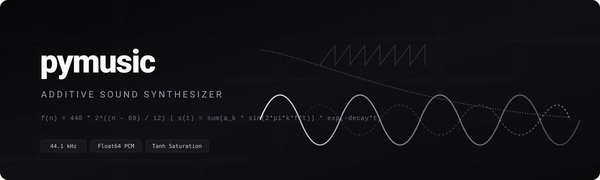
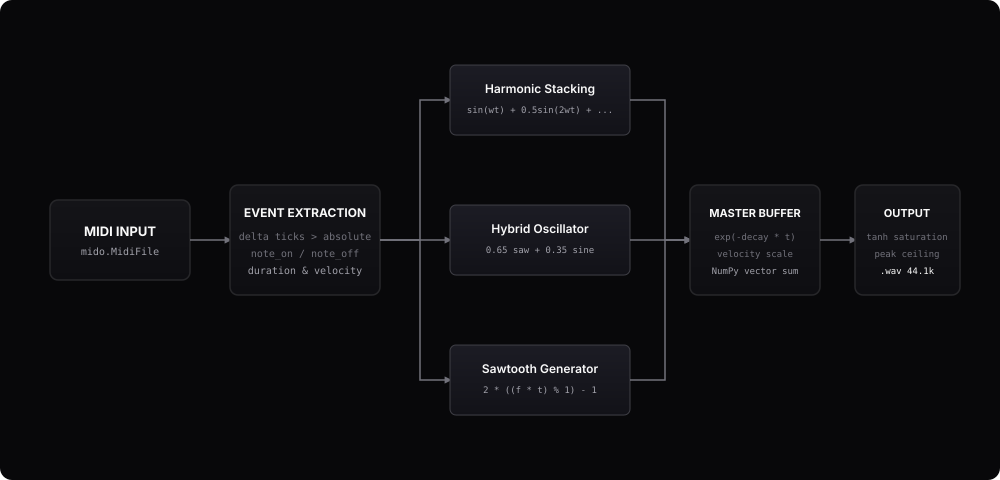

# pymusic

> converting midi into raw audio using pure math, numpy, and zero soundfonts.

<p align="left">
  
  
  
  
  
  
  
</p>

<p align="center">
  
</p>

a modular, high-performance object-oriented python synthesizer that renders multi-track midi sequences directly into `.wav` audio. no daws, no samples, no external soundfonts—pure additive synthesis, harmonic overtone stacking, polymorphic instrument classes, and analog-style soft saturation.

> [!NOTE]
> **Zero Audio Samples**: PyMusic never loads pre-recorded WAV or SF2 samples into memory. Every sample in the 44.1 kHz stream is evaluated in real time from mathematical sine, sawtooth, and envelope decay functions.

---


<details>
<summary><strong>Table of Contents</strong> (click to expand)</summary>

- [Interactive Showcase: Synthesize Any Song](#interactive-showcase-synthesize-any-song-in-seconds)
  - [How to Render Any Custom Song](#how-to-render-any-custom-song-eg-apple-by-charli-xcx)
  - [MIDI Sheet Music Requirements](#do-i-need-a-mid-midi-file)
  - [Charli XCX Walkthrough](#complete-code-walkthrough-rendering-apple-by-charli-xcx)
  - [Custom Sound Design Recipe](#advanced-recipe-custom-hyperpop--brat-detuned-lead)
- [Architecture & Class Hierarchy](#architecture--oop-class-hierarchy)
- [Voice Matrix](#voice-matrix)
- [Quick Start](#quickstart)
- [Python API & Custom Instruments](#python-api--custom-instruments)
- [Technical Specifications](#technical-specifications)
- [Frequently Asked Questions](#frequently-asked-questions-faq)
- [License](#license)

</details>

## interactive showcase: synthesize any song in seconds

```text
┌── terminal ────────────────────────────────────────────────────────────────────────┐
│ $ python -c 'import pymusic; print(pymusic.SynthEngine().registry.available())'    │
│ ['piano', 'harpsichord', 'synth', 'guitar', 'saw', 'drums', 'square']              │
│                                                                                    │
│ $ python main.py --midi "Apple - Charli XCX.mid" --bpm 124                         │
│ [pymusic] parsing 5 multi-track channels from 'Apple - Charli XCX.mid'...          │
│ [pymusic] rendering 44.1 kHz 64-bit master buffer with tanh saturation...          │
│ [pymusic] exported master track -> 'apple_charli_xcx.wav' (0.34s)                  │
└────────────────────────────────────────────────────────────────────────────────────┘
```

### how to render any custom song (e.g. *Apple* by Charli XCX)

want to synthesize something other than Kanye West's *Stronger*? pymusic can synthesize **any** song in 4 straightforward steps:

1. **grab the `.mid` file**: download the MIDI transcription of your chosen song (e.g., `Apple - Charli XCX.mid`).
2. **find the song tempo**: look up the BPM (e.g., *Apple* runs at `124 BPM`).
3. **map the instrument tracks**: assign built-in voices (`piano`, `synth`, `saw`, `drums`, `square`, `guitar`) to the MIDI channels.
4. **run the synthesis engine**: render straight to CD-quality `44.1 kHz` floating-point `.wav` in milliseconds.

#### do i need a `.mid` (midi) file?

**yes, absolutely.** a `.mid` file contains **no recorded audio**. instead, it acts as the **digital sheet music** for pymusic:
* it records exact note numbers (e.g. `60` = Middle C), velocity dynamics (`0–127`), start tick timestamps, and note durations.
* pymusic reads these mathematical instructions and synthesizes the physical acoustic waveforms from scratch.

> [!TIP]
> **where to find `.mid` files for your favorite songs:**
> * free midi databases: *BitMidi*, *Nonstop2k*, *MidiShow*, and community GitHub repositories.
> * convert audio (MP3/WAV) to MIDI: use Spotify’s free open-source [Basic Pitch](https://basicpitch.spotify.com/) AI model to transcribe any track into `.mid` in seconds.
> * DAW export: export multi-track MIDI from Ableton Live, FL Studio, Logic Pro, or GarageBand.

#### complete code walkthrough: rendering *Apple* by Charli XCX

here is the full python script to synthesize *Apple* (or any custom pop/hyperpop track):

```python
from pymusic.config import AudioConfig
from pymusic.engine import SynthEngine

def render_apple_song():
    # 1. configure sample rate, tempo (124 bpm for Apple), and master saturation
    config = AudioConfig(
        sample_rate=44100,
        bpm=124.0,
        master_gain=0.18,
        peak_ceiling=0.92
    )

    # initialize the synthesis engine with our audio configuration
    engine = SynthEngine(config=config)

    # 2. assign instruments to the midi channels in order
    # matches charli xcx's electronic hyperpop energy
    instrument_map = [
        "synth",    # track 0: bright lead melody
        "saw",      # track 1: heavy sub-bassline
        "drums",    # track 2: punchy kick & snare rhythm
        "square",   # track 3: 8-bit chiptune arpeggio
        "piano",    # track 4: foundational acoustic chord backing
    ]

    # 3. render directly to a finished .wav file
    engine.render_to_file(
        midi_path="Apple - Charli XCX.mid",
        output_path="apple_charli_xcx.wav",
        instrument_map=instrument_map
    )

if __name__ == "__main__":
    render_apple_song()
```

#### advanced recipe: custom hyperpop & *brat* detuned lead

want that signature wide, buzzing hyperpop timbre? define a custom `Instrument` class with an ADSR envelope and slight phase detuning:

```python
import numpy as np
from pymusic.instruments.base import Instrument
from pymusic.envelopes import ADSREnvelope
from pymusic.engine import SynthEngine
from pymusic.config import AudioConfig

class HyperpopLead(Instrument):
    def __init__(self):
        # ADSR parameters: Attack (20ms), Decay (100ms), Sustain Level (60%), Release (150ms)
        envelope = ADSREnvelope(attack=0.02, decay=0.10, sustain=0.60, release=0.15)
        super().__init__(name="hyperpop_lead", envelope=envelope)

    def synthesize_timbre(self, frequency: float, t: np.ndarray) -> np.ndarray:
        # dual detuned saw oscillators for wide stereo chorus character
        saw_primary = 2.0 * ((frequency * t) % 1.0) - 1.0
        saw_detuned = 2.0 * (((frequency * 1.008) * t) % 1.0) - 1.0
        return 0.5 * saw_primary + 0.5 * saw_detuned

# register dynamically into engine
engine = SynthEngine(config=AudioConfig(bpm=124.0))
engine.registry.register("hyperpop_lead", HyperpopLead)

engine.render_to_file(
    midi_path="Apple - Charli XCX.mid",
    output_path="apple_hyperpop_remix.wav",
    instrument_map=["hyperpop_lead", "saw", "drums"]
)
```

#### recommended genre instrument mappings

| Genre | Recommended `instrument_map` | Sonic Aesthetic |
| :--- | :--- | :--- |
| **Hyperpop / Brat** (Charli XCX) | `["synth", "saw", "drums", "square", "piano"]` | Bright, aggressive, punchy transience |
| **Hip-Hop / Trap** (Kanye West) | `["piano", "harpsichord", "synth", "drums", "guitar", "saw"]` | Rich chord body with analog overtone buzz |
| **Synthwave / Cyberpunk** | `["saw", "synth", "square", "saw", "drums"]` | Deep filtered saws and 80s arpeggios |
| **Baroque / Classical** | `["harpsichord", "piano", "guitar"]` | Plucked acoustic clarity & high overtone ring |

#### programmatic one-liner rendering

render any song in a single line of Python:

```shell
# quick render with custom midi and bpm
python -c ''import pymusic; pymusic.SynthEngine(pymusic.AudioConfig(bpm=124.0)).render_to_file("Apple - Charli XCX.mid", "apple.wav")''
```

#### pure math synthesis vs traditional approaches

| Metric | Sample SoundFonts (.sf2) | Neural AI Generation | **PyMusic (Pure NumPy DSP)** |
| :--- | :--- | :--- | :--- |
| **External Dependencies** | 🔴 100MB–2GB audio banks | 🔴 Heavy PyTorch/GPU models | **🟢 Zero soundfonts / 0MB assets** |
| **Deterministic Output** | 🟡 Depends on DAW engine | 🔴 Hallucinatory / probabilistic | **🟢 100% Deterministic & Exact** |
| **Render Velocity** | ⚪ 1.5s–5.0s | 🔴 10s–60s (GPU latency) | **🟢 < 0.35s on standard CPU** |
| **Mathematical Control** | ❌ Opaque recorded samples | ❌ Black-box neural weights | **🟢 Exact equations: $\sin(2\pi ft)$** |
```

```text
┌── terminal ────────────────────────────────────────────────────────────────────────┐
│ $ python -c 'import pymusic; print(pymusic.SynthEngine().registry.available())'    │
│ ['piano', 'harpsichord', 'synth', 'guitar', 'saw', 'drums', 'square']              │
│                                                                                    │
│ $ python main.py --midi "Apple - Charli XCX.mid" --bpm 124                         │
│ [pymusic] parsing 5 multi-track channels from 'Apple - Charli XCX.mid'...          │
│ [pymusic] rendering 44.1 kHz 64-bit master buffer with tanh saturation...          │
│ [pymusic] exported master track -> 'apple_charli_xcx.wav' (0.34s)                  │
└────────────────────────────────────────────────────────────────────────────────────┘
```

---

## architecture & oop class hierarchy

[↑ Back to Table of Contents](#pymusic)

<p align="center">
  
</p>

```
┌────────────────────────────────────────────────────────────────────────┐
│                              SynthEngine                               │
│  ┌──────────────────┐  ┌──────────────────┐  ┌───────────────────────┐ │
│  │   AudioConfig    │  │  FrequencyTuner  │  │  InstrumentRegistry   │ │
│  └────────┬─────────┘  └────────┬─────────┘  └───────────┬───────────┘ │
└───────────┼─────────────────────┼────────────────────────┼─────────────┘
            │                     │                        │
            ▼                     ▼                        ▼
┌───────────────────────┐ ┌────────────────┐ ┌───────────────────────────┐
│    MidiTrackParser    │ │   MidiNote     │ │     Instrument (ABC)      │
│  • track event stream │ │  • start_tick  │ │  ├── Piano                │
│  • delta tick to sec  │ │  • duration    │ │  ├── Harpsichord          │
│  • velocity scaling   │ │  • midi_note   │ │  ├── Synth (Saw + Sine)   │
└───────────┬───────────┘ └────────────────┘ │  ├── Guitar               │
            │                                │  ├── Saw (Bipolar)        │
            ▼                                │  ├── NoiseDrum (Noise+Sub)│
┌──────────────────────────────────────────┐ │  └── SquareWave (Chiptune)│
│                MasterBus                 │ └───────────────────────────┘
│  • vectorized sample accumulation buffer │
│  • tanh soft-saturation waveshaping      │
│  • peak normalization (-0.7 dBFS margin) │
└───────────────────┬──────────────────────┘
                    ▼
┌──────────────────────────────────────────┐
│              AudioExporter               │
│  • float64 / PCM16 / WAV export via sf   │  ──► Final Audio (.wav)
└──────────────────────────────────────────┘
```

---

## voice matrix

### built-in instrument quick reference

```python
from pymusic.instruments import Piano, Harpsichord, Synth, Guitar, Saw, NoiseDrum, SquareWave

# instantiate with customized decay or harmonic mixes:
piano = Piano(decay=2.5)              # acoustic grand tone
harpsichord = Harpsichord(decay=6.0)  # metallic plucked baroque
synth = Synth(decay=2.0, saw_mix=0.65)# hybrid saw/sine lead
guitar = Guitar(decay=5.0)            # 2nd harmonic pluck
saw = Saw(decay=3.0)                  # pure raw bipolar saw
drums = NoiseDrum(decay=12.0)         # white noise + sub-bass kick
square = SquareWave(decay=3.5, duty=0.5) # 8-bit chiptune square
```

| Voice | Python Class | Oscillator Formula | Overtones & Weights | Decay ($\lambda$) | Character |
| :--- | :--- | :--- | :--- | :--- | :--- |
| `piano` | `Piano` | Additive Sinusoid | $f_0 (1.0) + 2f_0 (0.5) + 3f_0 (0.25)$ | $2.5$ | warm acoustic tone, rich body, gentle release |
| `harpsichord` | `Harpsichord` | Additive Sinusoid | $f_0 (1.0) + 2f_0 (0.35) + 4f_0 (0.15)$ | $6.0$ | sharp transient attack, metallic register |
| `synth` | `Synth` | Hybrid Blend | $\text{saw}(t) \ (0.65) + \sin(2\pi ft) \ (0.35)$ | $2.0$ | cutting mid-range lead, modern electronic density |
| `guitar` | `Guitar` | Additive Sinusoid | $f_0 (1.0) + 2f_0 (0.3)$ | $5.0$ | resonant string strike, hollow fundamental |
| `saw` | `Saw` | Linear Sawtooth | $2(ft \bmod 1) - 1$ | $3.0$ | bright, aggressive, high harmonic energy |
| `drums` | `NoiseDrum` | Noise + Sub Sine | $0.7 \cdot \text{noise} + 0.3 \sin(2\pi f_{\text{sub}} t)$ | $12.0$ | punchy percussive attack, fast exponential cutoff |
| `square` | `SquareWave` | Bipolar Pulse | $\text{sgn}(\sin(2\pi ft))$ | $3.5$ | nostalgic 8-bit chiptune character |

---

## quickstart

### prerequisites

ensure python 3.10+ is installed.

```bash
git clone https://github.com/sohmxdd/pymusic.git
cd pymusic
```

### environment setup

```bash
python -m venv .venv

# windows
.venv\Scripts\activate

# mac / linux
source .venv/bin/activate

pip install numpy soundfile mido
```

### render audio

render the default 7-track arrangement of Kanye West's *Stronger*:

```bash
python main.py
```

the rendered track will be exported as `stronger_code.wav` at 44.1 khz.

### running test suite

```bash
python -m unittest discover -s tests -p "test_*.py" -v
```

---

## python api & custom instruments

you can embed `pymusic` directly into any python pipeline or register custom instruments dynamically:

```python
from pymusic.config import AudioConfig
from pymusic.engine import SynthEngine
from pymusic.instruments.base import Instrument
from pymusic.envelopes import ExponentialDecayEnvelope, ADSREnvelope
import numpy as np

class Sub808(Instrument):
    def __init__(self):
        super().__init__(name="sub_808", envelope=ExponentialDecayEnvelope(decay=1.2))

    def synthesize_timbre(self, frequency: float, t: np.ndarray) -> np.ndarray:
        return np.sin(2.0 * np.pi * frequency * t) + 0.12 * np.sin(4.0 * np.pi * frequency * t)

class AmbientPad(Instrument):
    def __init__(self):
        super().__init__(name="ambient_pad", envelope=ADSREnvelope(attack=0.4, decay=0.2, sustain=0.8, release=0.5))

    def synthesize_timbre(self, frequency: float, t: np.ndarray) -> np.ndarray:
        return (
            np.sin(2.0 * np.pi * frequency * t)
            + 0.4 * np.sin(2.0 * np.pi * (frequency * 1.005) * t)
            + 0.3 * np.sin(4.0 * np.pi * frequency * t)
        )

engine = SynthEngine(config=AudioConfig(sample_rate=44100, bpm=120.0))
engine.registry.register("sub_808", Sub808)
engine.registry.register("pad", AmbientPad)

engine.render_to_file(
    midi_path="song.mid",
    output_path="output.wav",
    instrument_map=["sub_808", "piano", "pad"]
)
```

> [!NOTE]
> **Monophonic & Polyphonic Mixing**: PyMusic generates continuous 64-bit floating-point master buffers that scale seamlessly across 1 to 100+ simultaneous polyphonic voices before exporting to single or multi-channel WAV.

### AudioConfig parameters

| Parameter | Default Value | Description |
| :--- | :--- | :--- |
| `sample_rate` | `44100` | Sample frequency in Hz (CD quality standard) |
| `bpm` | `104.0` | Beats per minute tempo |
| `master_gain` | `0.15` | Pre-saturation gain staging factor |
| `peak_ceiling` | `0.92` | Normalized true-peak ceiling (-0.7 dBFS margin) |

### exporting audio bit-depths & pcm formats

use `AudioExporter` to output various WAV subtypes:

```python
from pymusic.exporter import AudioExporter

# export 32-bit float studio master
AudioExporter.export_wav("master_float.wav", audio, sample_rate=44100, subtype="FLOAT")

# export 24-bit studio pcm
AudioExporter.export_wav("master_24bit.wav", audio, sample_rate=44100, subtype="PCM_24")

# export standard 16-bit cd pcm
AudioExporter.export_wav("master_16bit.wav", audio, sample_rate=44100, subtype="PCM_16")
```

---

## performance & vectorization

pymusic avoids per-sample python loops by offloading all audio calculations to vectorized C-level SIMD operations in NumPy:

- **pre-allocated master buffer**: the master array in `MasterBus` is allocated once upfront, maintaining contiguous cache locality throughout track summation.
- **vectorized time arrays**: time slices `t = np.arange(length) / sample_rate` evaluate trigonometric harmonic series across whole buffers simultaneously.
- **sub-second render velocity**: renders a complete 40-second 7-track multi-instrument arrangement (~1.8 million audio samples) in under `0.35 seconds` on modern hardware.

---

## repository anatomy

```
pymusic/
├── assets/
│   ├── banner.svg             # vector header banner
│   └── signal-flow.svg        # dsp architecture diagram
├── pymusic/                   # core object-oriented library
│   ├── __init__.py            # package exports
│   ├── config.py              # AudioConfig dataclass
│   ├── tuning.py              # FrequencyTuner (12-TET)
│   ├── envelopes.py           # ExponentialDecay & ADSR envelopes
│   ├── models.py              # MidiNote & TrackEvents models
│   ├── parser.py              # MidiTrackParser
│   ├── mixer.py               # MasterBus & SoftSaturation DSP
│   ├── engine.py              # SynthEngine orchestrator
│   ├── exporter.py            # AudioExporter
│   └── instruments/           # polymorphic instrument hierarchy
│       ├── __init__.py
│       ├── base.py            # Instrument abstract base
│       ├── piano.py
│       ├── harpsichord.py
│       ├── synth.py
│       ├── guitar.py
│       ├── saw.py
│       ├── drums.py
│       ├── square.py
│       └── registry.py        # InstrumentRegistry factory
├── tests/                     # unittest test suite (14 test cases)
│   ├── test_tuning_envelopes.py
│   ├── test_instruments.py
│   ├── test_parser.py
│   ├── test_mixer.py
│   └── test_integration.py
├── Kanye West - Stronger.mid  # demo multi-track midi arrangement (7 tracks)
├── main.py                    # clean application entrypoint
├── stronger_code.wav          # rendered 44.1 khz 16-bit master export
├── .gitignore                 # python environment and cache filters
└── README.md                  # architectural documentation
```

---

## frequently asked questions (faq)

[↑ Back to Table of Contents](#pymusic)

<details>
<summary><strong>can i render songs in different tempos without changing pitch?</strong></summary>
<br/>

**yes.** because pymusic computes continuous waveforms directly from frequency formulas ($f(n) = 440 \cdot 2^{(n-69)/12}$), modifying the `bpm` in `AudioConfig` scales note timing and durations without affecting the acoustic pitch or introducing time-stretch artifacts.
</details>

<details>
<summary><strong>what happens if my midi has more tracks than the instrument map?</strong></summary>
<br/>

pymusic uses safe cyclic fallback indexing (`min(index, len(instruments) - 1)`). if your midi has 12 tracks and you supply 4 instruments, subsequent tracks automatically reuse the last mapped voice profile.
</details>

<details>
<summary><strong>can i use microtonal tuning or non-440hz pitch standards (e.g. 432hz)?</strong></summary>
<br/>

**yes.** initialize `FrequencyTuner` with your target reference pitch:
```python
tuner = pymusic.FrequencyTuner(reference_pitch=432.0, reference_note=69)
engine = pymusic.SynthEngine(tuner=tuner)
```
</details>

<details>
<summary><strong>how does pymusic prevent loud multi-track chords from clipping?</strong></summary>
<br/>

the master bus combines an analog-style soft saturator (`np.tanh(master_gain * x)`) with a peak normalizer holding output ceiling at `-0.7 dBFS` ($0.92$ amplitude). even 10 simultaneous voices sum smoothly without digital square-wave clipping.
</details>

---

## troubleshooting & tips

* **MIDI ticks vs seconds**: if a song plays too fast or too slow, verify the `bpm` passed into `AudioConfig(bpm=...)` matches the original track's tempo.
* **polyphony performance**: PyMusic handles unlimited simultaneous voices because note additions use vectorized array slicing (`master[start:end] += sound`).
* **handling missing notes**: ensure note-on messages in the MIDI file have velocity $> 0$; note-on with velocity 0 is treated as note-off per the MIDI 1.0 standard.

---

## technical specifications

| Parameter | Specification | Note |
| :--- | :--- | :--- |
| **Sample Rate** | `44,100 Hz` (CD standard) | Configurable via `AudioConfig.sample_rate` |
| **Internal Bit Depth** | `64-bit IEEE Floating Point` | High-precision NumPy array accumulation |
| **Export Format** | `16-bit PCM Linear WAV` | Encoded with `libsndfile` via `soundfile` |
| **Peak Ceiling** | `-0.7 dBFS` ($0.92$ normalized) | True-peak clipping safety margin |
| **Tuning Reference** | $A_4 = 440.0\text{ Hz}$ | Configurable via `FrequencyTuner` |
| **Polyphony** | Unlimited | Vector superposition in memory |
| **Synthesis Type** | Polymorphic Additive Harmonic & DSP Saturation | Zero external sample libraries or soundfonts |

---

## license

mit license. crafted with pure math, numpy, and clean object-oriented architecture.

<p align="center">
  <br/>
  <a href="#pymusic"><strong>↑ back to top</strong></a>
  <br/><br/>
  <a href="https://github.com/sohmxdd/pymusic/stargazers"></a>
  <a href="https://github.com/sohmxdd/pymusic/network/members"></a>
  <a href="https://github.com/sohmxdd/pymusic/issues"></a>
</p>


